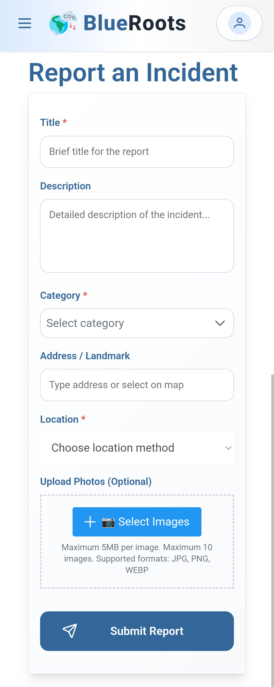
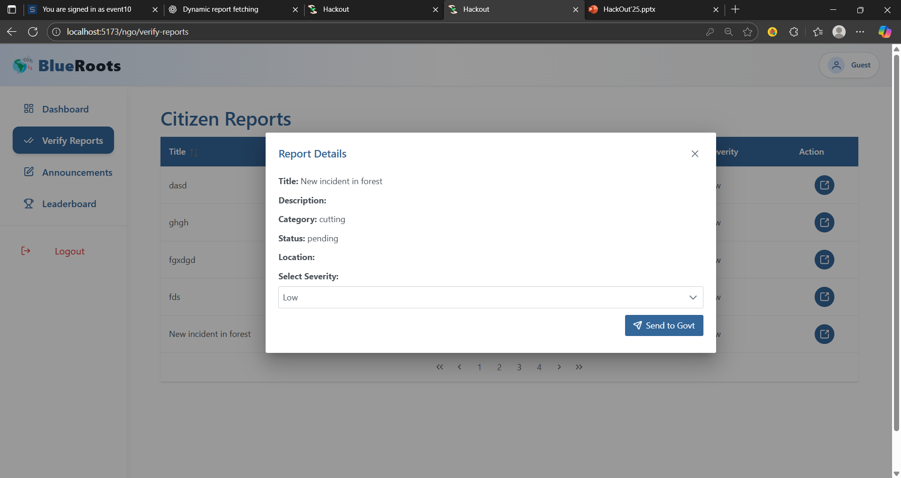
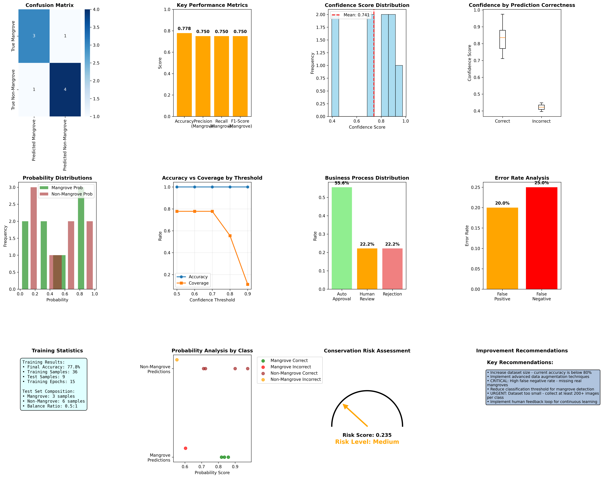
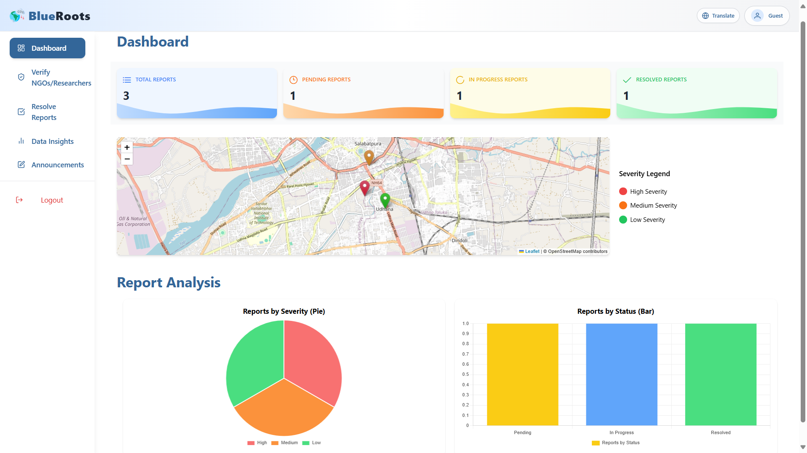
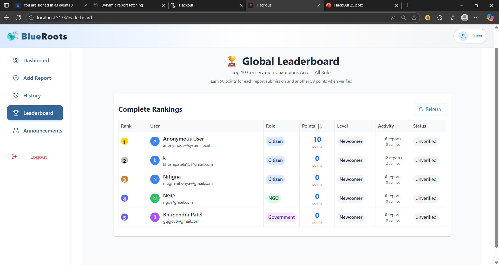
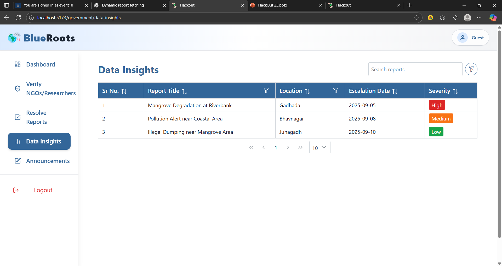

🌱 BlueRoot - Community Mangrove Watch

🛑 Problem Statement: Mangroves play a vital role in coastal ecosystems by preventing erosion,
supporting biodiversity, and acting as natural buffers against storms. However, monitoring mangrove
health is challenging, especially in remote areas. Coastal communities, NGOs, and government bodies
often lack a unified platform to report, verify, and act upon environmental changes affecting
mangroves.

🌊 HackOut Challenge: Develop a community-driven platform that connects citizens, NGOs, and
government authorities to monitor, protect, and restore mangroves effectively using AI and
technology.

💡 Our Solution **BlueRoot** is a web and PWA(Progressive Web Application) platform that empowers
coastal communities to report mangrove issues, NGOs to validate reports, and government authorities
to take action. AI-driven validation ensures authenticity, while citizen contributions are rewarded.
Researchers also gain insights for future predictions and studies.

✨ Key Features:

-   🌐 Multilingual support for local community users.
-   🤖 AI-powered report validation.
-   ✅ NGO verification and government action workflow.
-   🏅 Citizen recognition system through points for verified contributions.
-   📊 Data sharing with researchers for predictive analysis.

🏃‍♂️ Project Flow:

1. **📝 Citizen Uploads Report:** Coastal community members upload photos, videos, or textual
   reports of mangrove conditions.
2. **🤖 AI Validation:** The platform automatically validates the report using AI to ensure
   authenticity.
3. **✅ NGO Verification:** Verified NGOs cross-check the report for accuracy and provide additional
   insights.
4. **🏛️ Government Action:** Validated reports are forwarded to government authorities for action
   and response is forwarded to citizens.
5. **🔬 Problem Resolution & Research:** Resolved issues are marked, and the data is shared with
   researchers for future predictions.
6. **🎖️ Citizen Rewards:** Users whose reports are verified earn points and recognition,
   incentivizing accurate contributions.

📊 Screenshots / Prototype:

**Report Upload / Citizen Portal**  

**Admin / NGO Verification**  

**AI / ML Analytics** 

**govt-dashboard** 

**Leaderboard** 

**Data-Insights** 

🛠️ Technology Stack:

**💻 Frontend:** React, Vite, PrimeReact, TailwindCSS  
**🖥️ Backend:** Node.js, Express.js  
**🗄️ Database:** MongoDB  
**🔐 Authentication:** JWT  
**📂 File Upload & Storage:** Multer, Local storage  
**🤖 AI Validation:** Python/ML module  
**🗺️ Maps & Geolocation:** Google Maps API  
**🚀 Deployment:** Node server + Vite PWA

🚀 Repo Link:

**Clone the repository** git clone https://github.com/KHUSHI-P15/Hackout.git
